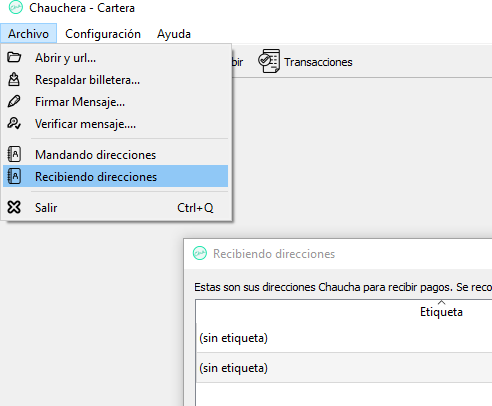

# Como minar Chauchas
[Aporte de Goro2030](https://github.com/Goro2030)

Para poder minar criptomonedas son necesarias dos cosas: Una *dirección* válida para almacenar tus ganancias y un software de minado específico para tus requerimientos de Hardware.

*IMPORTANTE: MUCHOS ANTIVIRUS DETECTAN ESTAS APLICACIONES COMO VIRUS, NO LO SON! DEBES CREAR ALGUNA REGLA EN TU ANTIVIRUS PARA QUE NO LOS BORRE O BLOQUEE.*

## Obtener una dirección valida (Wallet)

Las direcciones de la Red Chaucha se obtienen utilizando la Chauchera, que es un software que te permite enviar y recibir Chauchas desde tu computadora. Este software esta disponible en la [página web](https://www.chaucha.cl/#downloads) oficial del Proyecto Chaucha, en la sección de *Descargas*.

Al descargar la chauchera y ejecutarla por primera vez, esta comenzara a descargar toda la cadena de transacciones que hay hasta ese momento. 

Mientras se sincroniza tu chauchera puedes ir al menu superior y ver la opcion *Recibir*, en donde verás un codigo (en la seccion dirección) que es tu billetera virtual o wallet, con ese codigo podras minar chauchas, es basicamente una direccion a donde irán tus chauchas minadas.



## Instalación y uso del software de minado

El software que necesitarás para minar criptomonedas depende de las especificaciones técnicas de tus computadora, y es recomendable realizar el proceso de minado con una buena ventilación del equipo para no sobrecalentar las piezas internas.

El proceso de minado lleva a tu computadora a un estado de estrés extremo, que acorta la esperanza de vida del dispositivo y puede llegar a causar daños si es realizada por tiempos prolongados. 

Recomendamos los siguientes 2 software para minar con tu tarjeta de video dedicada (GPU) o usando los recursos del procesador de tu computadora (CPU).

* GPU: [ccminer (NVIDIA)](https://github.com/tpruvot/ccminer/releases) y [cgminer (AMD)](https://github.com/nicehash/cgminer-3.7.2-scrypt-jane/releases)
* CPU: [cpuminer](https://github.com/pooler/cpuminer/releases)

Una vez que descargues el software de minado necesitas descomprimirlo en una carpeta, abrir el *Bloc de notas* y escribir la configuración del software. Para finalizar, guarda este archivo como *inicio.bat* en la misma carpeta que se encuentra el software de minado para facilitarte el proceso de configuración.

**(Para minar en [artesa.chaucha.cl](http://artesa.chaucha.cl/) necesitas [registrarte](http://artesa.chaucha.cl/public/index.php?page=register) con una dirección válida de la red y ademas debes crear un [Worker](http://artesa.chaucha.cl/public/index.php?page=account&action=workers))**

### Minado con CPU
```minerd -a scrypt -o stratum+tcp://artesa.chaucha.cl:3008 -u usuario.worker -p ClaveDelWorker ```

### Minado con GPU

#### Nvidia

```ccminer-x64 -a scrypt -o stratum+tcp://artesa.chaucha.cl:3008 -u usuario.worker -p ClaveDelWorker ```

#### AMD

```cgminer.exe --scrypt --url=stratum+tcp://artesa.chaucha.cl:3008 --usuario.worker:ClaveDelWorker```

Al ejecutar el archivo de inicio el software de minado se conectará automaticamente a la *Mining Pool* y comenzará a minar.

## Verificando que estes minando correctamente

Puedes ver las estadisticas de minado en la sección [Worker Information](http://artesa.chaucha.cl/public/index.php?page=dashboard). 

Busca la dirección de tu wallet en la lista y podrás ver el *Hashrate* real que esta obteniendo la *Mining Pool* por el trabajo de tu computadora.

Además de esto, puedes comprobar que el proceso de minado se esta desarrollando correctamente al observar la pantalla del software de minado.

