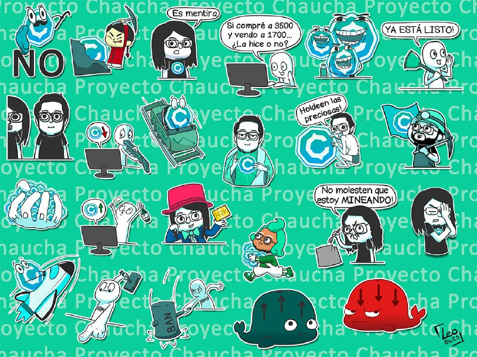

Mi nombre es Leonardo Quezada, en mis redes [Leo8bits](https://www.facebook.com/Leo8bits/), soy ilustrador y hasta hace 1 mes y medio (mediados de Diciembre) de criptomonedas solo conocía la Bitcoin y no tenía idea de nada mas al respecto.

Recuerdo haberme enterado del Proyecto Chaucha por un amigo que compartió la noticia de una web que ya no recuerdo, lo leí en la mañana, recién despertando y sin lentes, me olvidé de todo. Ese mismo día en la tarde me volvió a aparecer la noticia compartida por mi mismo amigo, entré de nuevo y volví a leer todo, le comenté a mi pareja y me respondió *“mish, que buena, cierto?”* le dije yo, más tarde descargué la wallet.

Al día siguiente tenía un evento de ilustración, esos donde va la gente ñoña y compran stickers y posters, como andaba con mi notebook aproveché de entrar en la web del proyecto otra vez y leí sobre OrionX, ese día la chaucha se transaba a 530 pesos, *"ya po, demosle"* le dije a mi pareja, y compré 5 Chauchas con lo que tenía en mi cuenta. Durante todo el evento estuve más pendiente del comportamiento de la moneda que de lo que estaba pasando a mi alrededor.

Entré al grupo de telegram, por esos días (bueno aun hoy) casi no hablaba, pero leía todo. De a poco fui aprendiendo tecnicismos y sobre el mundo de las crypto. En el mismo telegram veía que la gente enviaba stickers relacionados con la Chaucha y recordé que hace unos años un amigo me pidió que le hiciera un par de stickers para usarlos allí, así que se me ocurrió hacer algunos, mas que nada para auto promocionarme (lo siento jajaja), dibujé 4 o 5 unas horas antes de viajar.

Tuvieron buena aceptación, me sugirieron varios stickers mas y algunos usuarios me donaron algunas Chauchas por el trabajo, lo que me motivó a seguir haciendo stickers, para alegrar el chat mas que nada (y de paso ver si caía alguna chauchita mas), con el paso de los días y con caída de precio y todo (inicios de enero) quise seguir aportando mi granito de arena al proyecto, Camilo (uno de los desarrolladores de Chaucha) me contactó varias veces para pedirme dibujos, pagados en Chaucha obviamente, y como lo encontré un medio de pago super cómodo y rápido decidí implementarlo para los pedidos en mi fan page, funcionó y sigue funcionando super bien.

Me alegra haber llegado al proyecto cuando estaba empezando a tomar vuelo y me alegra seguir dentro aportando tanto a la comunidad como al uso de la Chaucha.
