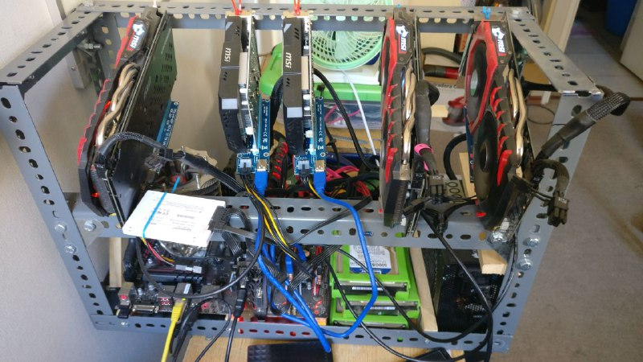

# La chauchera perdida

Todo partió cuando césar posteo en el grupo de programadores chile en facebook y yo no conocía nada de las criptos, solo conocía ethereum y bitcoin, por lo que había jugado con p500 en modo demo, para aprender a tradear, pero el resto era solo desconocimiento.

Y como no había minando nunca una cripto, quería aprender.

Me puse a leer la página de chaucha, vi que eran pocos minando, así que le di con fe intentando minar, creo que sacaba como 50 Kh/s con mi procesador y 180 Kh/s con mi gpu vieja, y así a pura fe los primeros días gane como 5 chauchas. Dejaba el pc prendido minando, meti el minero en mi pc de la pega a 1 solo hilo, para poder seguir usarlo configure una máquina cloud y la deje minando.

Todo eso sucedió en septiembre y luego me olvide de la chaucha por unas semanas… respalde mi wallet en un pendrive y formatié mi computador.

Cuando vi que la chaucha ahora valía alrededor de 20 pesos, me dije “oohh y mis chauchas?” y no encontraba el pendrive por ninguna parte, ni sabia cuantas chauchas tenía, entonces instale un recuperador de archivos para que escaneara el disco duro buscando la wallet a pura fe. Después de 20 horas revisando todos los archivos recuperados encontré mi wallet con la agradable sorpresa de 2200 chauchas, porque la máquina de cloud se quedó minando por casi un mes sin que la banearan.

No sabia como tradear, así que con miedo vendi 20 CHA, luego compre 22 CHA con la ganancia y así haciendo scalping y aprendiendo de todo un poco, minería, trading, desarrollo sobre blockchain. 

A final de diciembre me quebré la clavicula, y el medico me prohibió programar por 1 mes, solo podía leer o escribir en el teléfono. Ahí fue luego de leer mucho me metí en la minería, vendí algunas de mis CHA para comprar tarjetas de video, placa, fuente (de hecho creo que fui el que se llevó la últimas tarjetas de video de 2 tiendas) y fue todo un desafío armar un rig solo con la mano izquierda.

Y ahora ando minando de todo, menos chauchas, porque no me gusta arrendar para minar. 

Ahora incluso con el precio actual, no me arrepiento de estar guardando 500 CHA para el futuro, le tengo fé al proyecto.

Ha sido uno de los veranos donde más he aprendido y les doy las gracias, porque ha sido bakan entrar a este mundo.

*- Pablo*